# Kepler

Kepler is a deployable, Linear-driven control plane built on top of Symphony's workspace and
runner model. It receives Linear Agent Session webhooks, routes each session to a pre-registered
repository, runs Codex in an isolated workspace, opens or updates a GitHub pull request, and links
that PR back to Linear.

This repository still contains the original Symphony spec and the legacy local polling workflow,
but the primary product direction in this branch is Kepler hosted mode.

> [!WARNING]
> Kepler v1 is intentionally narrow. It is single-node, file-state-backed, and designed for
> trusted internal environments first.

## What Kepler Does

- Accepts Linear Agent Session webhooks at a fixed HTTPS endpoint.
- Fetches issue context and optional Linear repository suggestions through authenticated GraphQL.
- Resolves the issue to one pre-registered repository from `kepler.yml`.
- Synchronizes a workspace, checks out a canonical issue branch, and runs Codex in app-server mode.
- Requires structured PR handoff output so PR descriptions contain real summary and validation
  evidence.
- Publishes or updates a GitHub PR and writes Linear backlinks through session URLs and issue
  attachments when the corresponding Linear API calls succeed.

## Architecture

```mermaid
flowchart LR
    Linear["Linear Agent Session<br/>webhook + GraphQL"] -->|POST /webhooks/linear| Kepler["Kepler control plane"]
    Kepler --> Routing["Repository routing<br/>registered repos only"]
    Routing --> Workspace["Workspace sync<br/>clone/fetch/reset"]
    Workspace --> Branch["Canonical issue branch<br/>kepler/&lt;issue&gt;"]
    Branch --> Codex["Codex app-server run"]
    Codex --> Report[".kepler/workpad.md<br/>.kepler/pr-report.json"]
    Report --> GitHub["Push branch + create/update PR"]
    GitHub --> LinearLink["Update session externalUrls<br/>Create issue attachment"]
```



## Kepler v1 Boundaries

- Single process, single node.
- One Linear workspace per deployment.
- Repository access is allowlist-based through `kepler.yml`.
- One run routes to one writable repository.
- A repository may expose additional read-only reference repositories for cross-repo context.
- Recovery reuses the workspace path but reboots from a clean checkout of the configured default
  branch.
- The recommended Linear runtime auth path is OAuth `client_credentials`; `LINEAR_API_KEY` remains
  fallback-only for staging or migration.

## Quick Start

1. Read the operator guide: [docs/kepler-self-hosting.md](docs/kepler-self-hosting.md).
2. Decide your deployment shape:
   - standard hosted path: use the root [Dockerfile](/Users/kevinslin/repos/kevin-harness-engineering/symphony/Dockerfile) and [railway.toml](/Users/kevinslin/repos/kevin-harness-engineering/symphony/railway.toml)
   - local/manual path: run from [elixir](elixir) with `mix build` and `./scripts/run-kepler.sh`
3. Start from the committed generic config at [elixir/kepler.yml](elixir/kepler.yml), point `KEPLER_CONFIG_PATH` at your own deployment config, or inject a private config through `KEPLER_CONFIG_YAML_BASE64` in container deployments.
4. Configure:
   - a Linear OAuth app with `actor=app`
   - `client_credentials`
   - Agent Session webhooks
   - GitHub auth, preferably a GitHub App
   - OpenAI / Codex auth for unattended `codex app-server`
5. If you are deploying to Railway, attach one persistent volume at `/data`, set the required env vars, and let Railway build from the root Dockerfile.
6. If you are running locally, launch Kepler:

```bash
cd elixir
mise trust
mise install
mise exec -- mix setup
mise exec -- mix build
./scripts/run-kepler.sh
```

The Docker path is the recommended v1 deployment path because it keeps Railway, GCP VM, and AWS
VM deployments close to the same operational model.

## Routing Model

Kepler only routes among repositories pre-registered in `kepler.yml`; it does not infer arbitrary
repo URLs from issue text. The most stable v1 pattern is one shared Linear project plus one unique
`repo:*` label per repository, with one implementation issue mapped to one repo. Full routing
guidance lives in [docs/kepler-self-hosting.md](docs/kepler-self-hosting.md).

If a repo needs upstream or downstream implementation context, register those as
`reference_repository_ids`. Kepler will sync them under `.kepler/refs/<repo-id>/` as read-only
context while keeping writes and PR publication limited to the selected primary repo.

## Workflow Model

Kepler supports a shared hosted workflow plus repo-local overrides. If a target repo does not
provide `repository.workflow_path`, Kepler falls back to the bundled shared workflow at
[elixir/priv/templates/WORKFLOW.kepler.template.md](elixir/priv/templates/WORKFLOW.kepler.template.md).
That fallback requires `.kepler/pr-report.json`, frontend screenshot evidence for user-visible
changes, passing automated tests for backend or smart-contract changes, and a pre-flight audit of
repo state, Linear status, tool/auth availability, and existing PR feedback. Repo-local overrides
are allowed, but they must preserve the hosted PR handoff contract.

## Documentation Map

- Product scope and architecture: [docs/kepler-prd.md](docs/kepler-prd.md)
- Self-hosting and operator setup: [docs/kepler-self-hosting.md](docs/kepler-self-hosting.md)
- Railway-ready deployment files:
  - [Dockerfile](Dockerfile)
  - [railway.toml](railway.toml)
  - [elixir/scripts/docker-entrypoint.sh](elixir/scripts/docker-entrypoint.sh)
  - [elixir/kepler.yml](elixir/kepler.yml)
- Elixir runtime commands and mode-specific details: [elixir/README.md](elixir/README.md)
- Hosted fallback workflow contract:
  [elixir/priv/templates/WORKFLOW.kepler.template.md](elixir/priv/templates/WORKFLOW.kepler.template.md)
- Original Symphony spec: [SPEC.md](SPEC.md)

## Legacy Symphony Mode

The repository still includes the original local Symphony workflow:

- project polling instead of Linear Agent Session webhooks
- repo-local `WORKFLOW.md` driven by the local tracker state machine
- one repository per service process

That mode is still documented in [elixir/README.md](elixir/README.md), but it is not the hosted
Kepler path.

## License

This project is licensed under the [Apache License 2.0](LICENSE).
