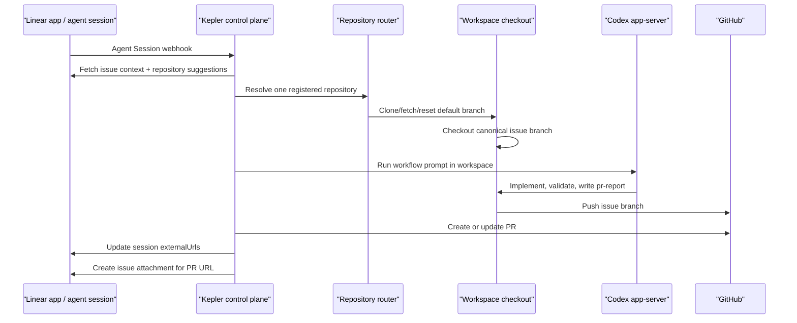
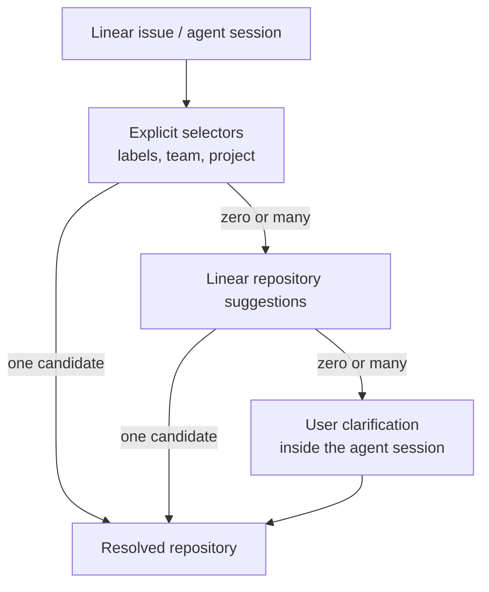

# Kepler in Elixir

This directory contains the current Elixir/OTP reference implementation for two related modes:

- `Kepler`: the hosted, multi-repository control plane built on top of Symphony's workspace and
  runner model
- `Symphony local mode`: the original polling-based single-repository workflow driven by a local
  `WORKFLOW.md`

If you are self-hosting for a real team, Kepler is the primary mode to use.

Use this README together with:

- [../docs/kepler-self-hosting.md](../docs/kepler-self-hosting.md) for operator setup details
- [../docs/kepler-prd.md](../docs/kepler-prd.md) for product scope and architecture
- [./templates/kepler.yml.example](./templates/kepler.yml.example) for config structure

> [!WARNING]
> Kepler v1 is designed for trusted internal environments. It is currently single-node,
> file-state-backed, and should not be deployed as a horizontally scaled service.

## Mode Overview

| Mode | Recommended use | Trigger model | Repo scope |
| --- | --- | --- | --- |
| `Kepler` | Hosted internal service | Linear Agent Session webhooks | Many pre-registered repos |
| `Symphony local mode` | Legacy local experimentation | Linear polling | One repo per service process |

## Hosted Architecture



## Kepler Quick Start

Recommended deployment path for this branch: build the repository root
[Dockerfile](../Dockerfile) and run it on Railway with one persistent `/data` volume.
The local `mix build` flow below is still useful for development and debugging.

### 1. Install prerequisites

We recommend [mise](https://mise.jdx.dev/) for Elixir and Erlang.

```bash
mise install
mise exec -- elixir --version
```

You also need:

- a public HTTPS hostname
- a writable persistent volume
- the `codex` binary available non-interactively on the host
- GitHub auth with clone, push, and PR access
- a Linear app configured for Agent Session webhooks

### 2. Create local config files

```bash
cd elixir
cp templates/kepler.yml.example kepler.yml
cp templates/.env.kepler.example .env.kepler
```

Use env-backed values in `kepler.yml`. Kepler caches config and resolved env values at boot, so
restart the service after config changes or secret rotation.

### 3. Fill `kepler.yml`

At minimum, set:

- `linear.client_id` and `linear.client_secret`
- `linear.webhook_secret`
- `workspace.root`
- `state.root`
- `repositories[]`

`LINEAR_API_KEY` is still supported, but only as a fallback for staging or migration.

### 4. Register repositories

Kepler only operates on repositories listed in `repositories[]`. Each registration includes:

- `id`
- `full_name`
- `clone_url`
- `default_branch`
- `workflow_path`
- routing selectors such as `labels`, `team_keys`, `project_ids`, or `project_slugs`

Minimal example:

```yaml
repositories:
  - id: "core"
    full_name: "your-org/core"
    clone_url: "https://github.com/your-org/core.git"
    default_branch: "main"
    workflow_path: "WORKFLOW.md"
    provider: "codex"
    labels: ["repo:core"]

  - id: "frontend"
    full_name: "your-org/orbit-frontend"
    clone_url: "https://github.com/your-org/orbit-frontend.git"
    default_branch: "main"
    workflow_path: "WORKFLOW.md"
    provider: "codex"
    labels: ["repo:frontend"]
```

### 5. Launch Kepler locally

```bash
cd elixir
mise trust
mise install
mise exec -- mix setup
mise exec -- mix build
./scripts/run-kepler.sh
```

`run-kepler.sh` sources `./.env.kepler` by default, then starts:

```bash
./bin/symphony kepler --config ./kepler.yml
```

To use a different env file or config file:

```bash
KEPLER_ENV_FILE=/path/to/.env.kepler \
KEPLER_CONFIG_PATH=/path/to/kepler.yml \
./scripts/run-kepler.sh
```

## Railway / Docker Deployment

This branch now ships a Docker-first deployment path so you do not need to hand-assemble Railway
build and start commands.

Shipped deployment files:

- [../Dockerfile](../Dockerfile)
- [../railway.toml](../railway.toml)
- [./scripts/docker-entrypoint.sh](./scripts/docker-entrypoint.sh)
- [./kepler.yml](./kepler.yml)

The default container behavior is:

1. use `elixir/kepler.yml` unless `KEPLER_CONFIG_PATH` overrides it, or materialize a private runtime config from `KEPLER_CONFIG_YAML_BASE64` / `KEPLER_CONFIG_YAML`
2. create `/data/home`, `/data/workspaces`, and `/data/state`
3. decode `GITHUB_APP_PRIVATE_KEY_BASE64` into `GITHUB_APP_PRIVATE_KEY` when needed
4. authenticate `codex` non-interactively from `OPENAI_API_KEY` when no cached login exists
5. launch Kepler through `./scripts/run-kepler.sh --port $PORT`

Recommended Railway settings:

- attach one volume at `/data`
- keep the service at one replica
- generate one public domain
- rely on the root `Dockerfile` and `railway.toml`

Required Railway secrets for the bundled config:

- `OPENAI_API_KEY`
- `LINEAR_WEBHOOK_SECRET`
- `KEPLER_WORKSPACE_ROOT=/data/workspaces`
- `KEPLER_STATE_ROOT=/data/state`
- either:
  - `LINEAR_CLIENT_ID` and `LINEAR_CLIENT_SECRET`
  - or `LINEAR_API_KEY` as a staging fallback
- either:
  - `GITHUB_APP_ID` and `GITHUB_APP_PRIVATE_KEY_BASE64`
  - or `GITHUB_TOKEN` as a fallback

If you do not want to commit a deployment-specific `kepler.yml`, add one of:

- `KEPLER_CONFIG_YAML_BASE64`
- `KEPLER_CONFIG_YAML`

The shipped container entrypoint will write that private config to `/data/config/kepler.yml`
at startup and point `KEPLER_CONFIG_PATH` at it automatically.

Optional but recommended:

- `KEPLER_API_TOKEN`

The container default also sets:

- `HOME=/data/home`
- `CODEX_BIN=codex`
- `KEPLER_CONFIG_PATH=/app/elixir/kepler.yml`

GitHub App key handling for Railway/Docker:

- generate a GitHub App private key from the GitHub App settings page
- convert the downloaded PEM to base64 on your machine
- store that value in Railway as `GITHUB_APP_PRIVATE_KEY_BASE64`
- let the shipped container entrypoint decode it into `GITHUB_APP_PRIVATE_KEY`
- keep `kepler.yml` on `github.private_key: $GITHUB_APP_PRIVATE_KEY`

Use `GITHUB_APP_PRIVATE_KEY_PATH` only for VM/local deployments where you actually control a stable
filesystem path to the PEM file.

## Linear Setup Summary

The recommended production path is:

1. Create a Linear OAuth app.
2. Install it into the target workspace with `actor=app`.
3. Enable `client_credentials`.
4. Enable `Agent session events` webhooks.
5. Run Kepler with:
   - `LINEAR_CLIENT_ID`
   - `LINEAR_CLIENT_SECRET`
   - `LINEAR_WEBHOOK_SECRET`

Important details:

- Webhooks are intake only. Kepler still needs authenticated GraphQL access to fetch issue context,
  post agent activities, request repository suggestions, and update sessions.
- The webhook route is fixed at `POST /webhooks/linear`.
- `GET /linear/oauth/callback` exists as a valid redirect target for the app install flow, but
  runtime auth comes from `client_credentials`, not authorization-code token storage.

Full setup details, including exact Linear form fields and the `actor=app` authorization URL, are
in [../docs/kepler-self-hosting.md](../docs/kepler-self-hosting.md).

## GitHub Setup Summary

Preferred path: GitHub App.

Minimum useful permissions:

- Repository metadata: read-only
- Repository contents: read and write
- Pull requests: read and write

Fallback path: `GITHUB_TOKEN`

Runtime behavior:

- Kepler uses GitHub credentials to clone, fetch, reset, push, and publish PRs.
- It does not accept arbitrary repo URLs from issue text.
- PR linking back into Linear does not depend on branch naming. Kepler explicitly:
  - updates the Linear agent session `externalUrls`
  - creates a Linear issue attachment for the PR URL
  - includes the Linear issue URL in the generated PR body
- The session update and attachment write are best-effort side effects. Kepler logs failures there
  instead of failing the whole run after code and PR publication already succeeded.

## Routing Strategy

Kepler routes each run to exactly one registered repository:

1. explicit repo selectors
2. Linear repository suggestions
3. user clarification inside the same Linear agent session

Current selector semantics are OR-based across `labels`, `team_keys`, `project_ids`, and
`project_slugs`, so deterministic routing depends on non-overlapping selectors. In practice, the
most stable pattern is one shared Linear project plus one unique `repo:*` label per repository.
The full operator guidance and label strategy live in
[../docs/kepler-self-hosting.md](../docs/kepler-self-hosting.md).



## Shared Workflow Contract

If a repo contains `repository.workflow_path`, Kepler uses that file.
Otherwise it falls back to the bundled shared workflow:

- [./priv/templates/WORKFLOW.kepler.template.md](./priv/templates/WORKFLOW.kepler.template.md)

The shared fallback is designed to be a usable organization default. It requires:

- a stable issue branch derived from the ticket identifier
- a local `.kepler/workpad.md` scratchpad
- a structured `.kepler/pr-report.json` handoff file for changed-file runs
- repo-native validation before completion
- frontend screenshot evidence for user-visible changes
- passing automated tests for backend and smart-contract changes
- commit and push before the run finishes

If you add a repo-local override later, that override must still emit a valid
`.kepler/pr-report.json` whenever it changes files or refreshes an existing PR. Hosted PR
publication treats that file as a hard contract.

The shared fallback is intended to be the organization default. Full report schema, screenshot
requirements, and override guidance live in
[../docs/kepler-self-hosting.md](../docs/kepler-self-hosting.md).

## Runtime Behavior

### Workspace and branch handling

Kepler does not run a plain `git pull`.

For an existing workspace:

1. `git remote set-url origin <clone_url>`
2. `git fetch origin <default_branch> --prune`
3. `git checkout <default_branch>`
4. `git reset --hard origin/<default_branch>`
5. checkout or recreate the canonical issue branch

For a first-time workspace:

1. `git clone <clone_url> .`
2. `git checkout <default_branch>`
3. create the canonical issue branch

PR publication is now guarded by runtime checks:

- the run must end on the expected issue branch
- the workspace must be clean after execution
- the remote issue branch must contain the same `HEAD` that generated the PR body

### Endpoints

- `POST /webhooks/linear`
- `GET /api/v1/kepler/health`
- `GET /api/v1/kepler/runs`
- `GET /linear/oauth/callback`

Only the webhook needs public internet reachability. `GET /api/v1/kepler/runs` now requires
`server.api_token` and a matching `Authorization: Bearer ...` or `x-kepler-api-token` header.
Protect the remaining observability surface with network controls or reverse-proxy auth. Health is
deliberately minimal and only reports `{mode, ok}`.

## Current Kepler Limitations

- Single process, single node.
- Do not run multiple replicas behind the same Linear webhook.
- Concurrency is serialized per Linear agent session, not per Linear issue.
- One run targets one writable repository.
- `reference_repository_ids` may add read-only sibling checkouts under `.kepler/refs/<repo-id>/`
  for cross-repo context, but Kepler still commits and opens PRs only from the selected primary
  repo.
- `kepler.yml` reads process environment variables only; it does not parse dotenv files on its own.

## Legacy Symphony Local Mode

The original local Symphony mode still works when you want a single-repository, polling-based
workflow.

### Local mode quick start

```bash
cd elixir
mise trust
mise install
mise exec -- mix setup
mise exec -- mix build
mise exec -- ./bin/symphony ./WORKFLOW.md
```

### Local mode behavior

1. Polls Linear for candidate work.
2. Creates a workspace per issue.
3. Launches Codex in app-server mode inside that workspace.
4. Sends the repo-local `WORKFLOW.md` prompt.
5. Keeps working until the issue leaves the active state set or reaches completion.

### Local mode configuration

Pass a custom workflow path to `./bin/symphony`:

```bash
./bin/symphony /path/to/custom/WORKFLOW.md
```

Optional flags:

- `--logs-root` to change the logs directory
- `--port` to enable the Phoenix observability service

Minimal local workflow example:

```md
---
tracker:
  kind: linear
  project_slug: "..."
workspace:
  root: ~/code/workspaces
hooks:
  after_create: |
    git clone git@github.com:your-org/your-repo.git .
agent:
  max_concurrent_agents: 10
  max_turns: 20
codex:
  command: codex app-server
---

You are working on a Linear issue {{ issue.identifier }}.
```

The longer local workflow example is in [./WORKFLOW.md](./WORKFLOW.md). It encodes the legacy
tracker-driven state machine and should not be confused with Kepler hosted mode.

## Development Checks

```bash
cd elixir
/opt/homebrew/bin/mise exec -- mix test
/opt/homebrew/bin/mise exec -- mix lint
MIX='/opt/homebrew/bin/mise exec -- mix' make all
```
